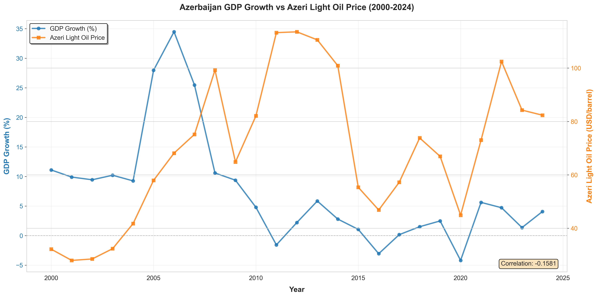
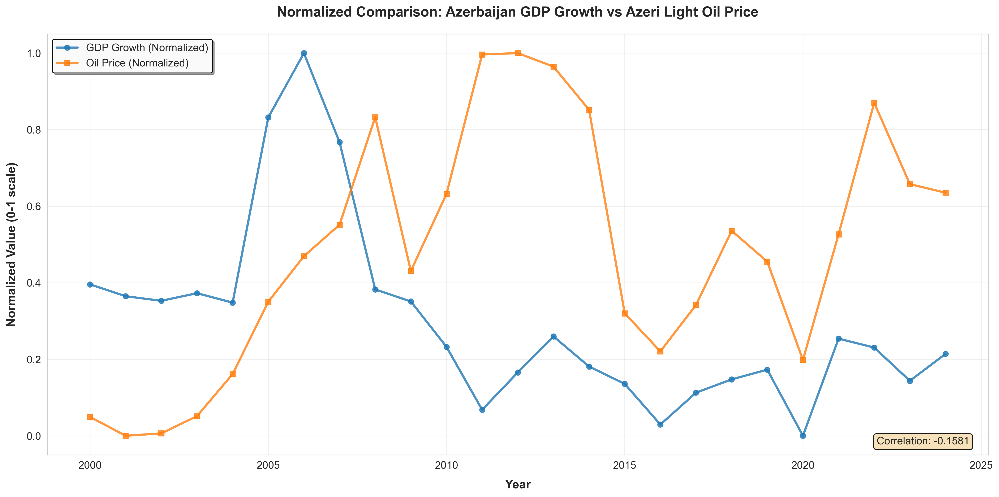
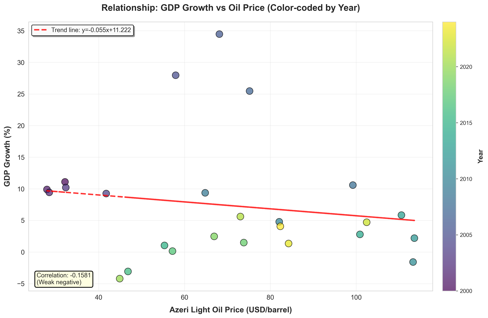
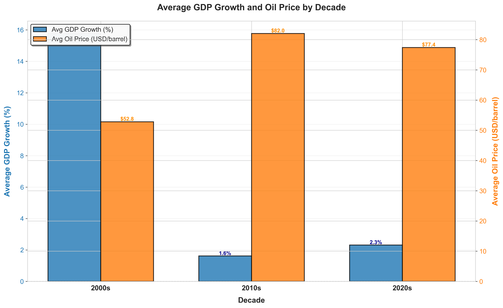
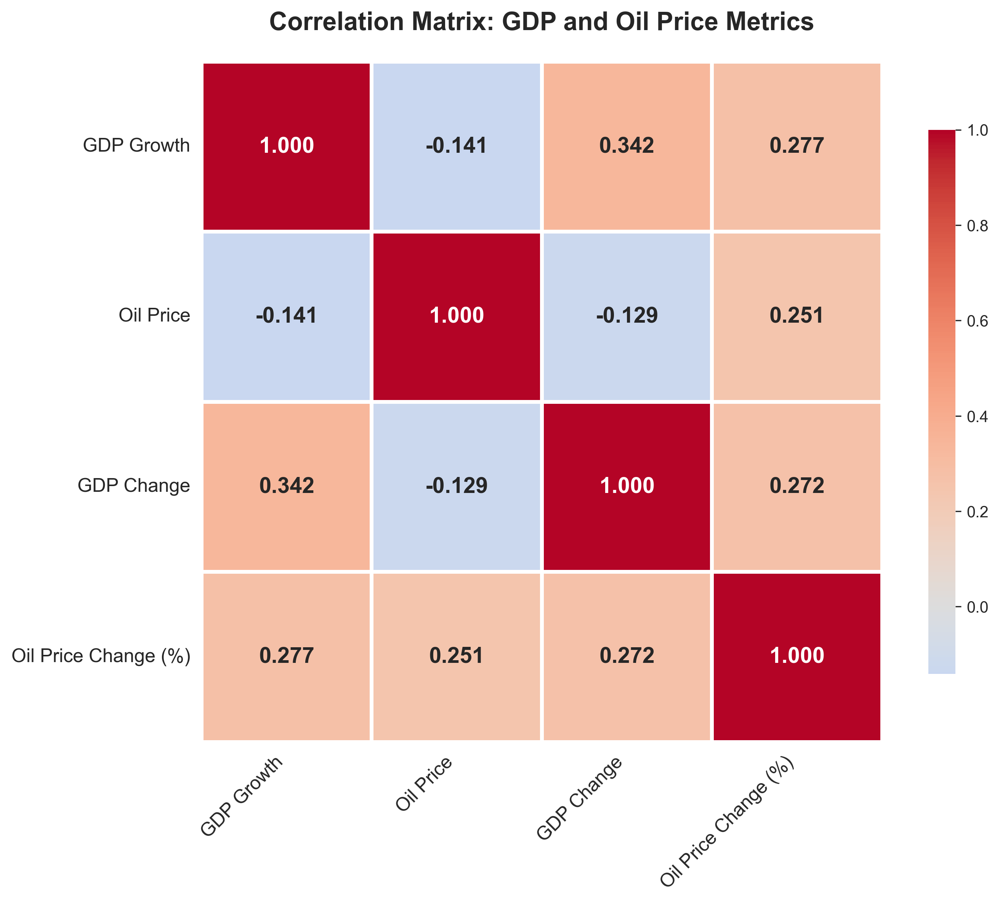
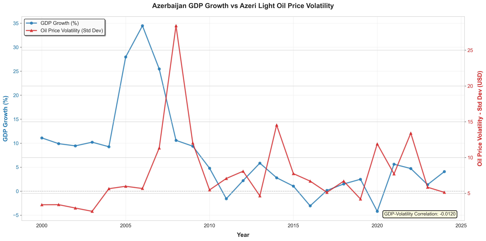

# Azerbaijan GDP Growth and Azeri Light Oil Price Analysis (2000-2024)

## Executive Summary

This analysis explores the relationship between Azerbaijan's GDP growth and Azeri Light crude oil prices over a 25-year period (2000-2024). The study reveals a **weak negative correlation (-0.1581)** between oil prices and GDP growth, challenging the conventional assumption that higher oil prices directly translate to stronger economic growth in oil-dependent economies.

## Table of Contents
- [Key Findings](#key-findings)
- [Data Sources](#data-sources)
- [Detailed Analysis](#detailed-analysis)
- [Methodology](#methodology)
- [How to Run](#how-to-run)
- [Conclusions](#conclusions)

---

## Key Findings

### 1. Weak Negative Correlation
- **Correlation coefficient: -0.1581** between GDP growth and oil prices
- This suggests that oil price fluctuations alone do not strongly predict GDP growth patterns
- Other economic factors (diversification, policy reforms, global markets) play significant roles

### 2. Economic Boom Period (2004-2008)
- Average GDP growth: **25.6%** during the oil boom
- Oil prices averaged **$68.1/barrel**
- Peak GDP growth of **34.5% in 2006** coincided with moderate oil prices (~$65/barrel)

### 3. Decade Comparison
- **2000s**: Average GDP growth of **13.3%** with oil prices at **$59.2/barrel**
- **2010s**: Average GDP growth of **2.3%** with higher oil prices at **$76.4/barrel**
- **2020s** (2020-2024): GDP growth recovered to **4.4%** with oil at **$72.7/barrel**

### 4. Economic Resilience
- Azerbaijan's economy showed negative growth in only **2 out of 25 years** (-4.2% in 2020 due to COVID-19)
- Recovery was swift: **5.6% growth in 2021** and **4.7% in 2022**

---

## Data Sources

### 1. GDP Growth Data
- **Source**: World Bank - World Development Indicators
- **Indicator**: GDP growth (annual %)
- **Indicator Code**: NY.GDP.MKTP.KD.ZG
- **Coverage**: 1991-2024 (analysis uses 2000-2024 for oil price overlap)
- **Last Updated**: December 19, 2025

### 2. Azeri Light Oil Price Data
- **Source**: Daily Azeri Light crude oil prices
- **Format**: Excel file with 6,559 daily observations
- **Coverage**: January 4, 2000 - 2025
- **Aggregation**: Yearly averages, standard deviation, min, and max calculated

---

## Detailed Analysis

### Chart 1: Time Series Comparison (Original Values)



**Purpose**: Visualize the temporal relationship between Azerbaijan's GDP growth and oil prices over 25 years.

**Key Insights**:
- **2006 Peak**: Highest GDP growth (34.5%) occurred when oil was at $65/barrel, not at peak oil prices
- **Oil Price Peaks** (2011-2012 at ~$110/barrel) corresponded with **moderate GDP growth** (2-5%)
- **COVID-19 Impact** (2020): GDP contracted by 4.2% despite oil prices dropping to $46/barrel
- **Recent Trend** (2021-2024): Stable GDP growth (4-6%) with volatile oil prices ($73-$103/barrel)

**Finding**: The relationship is **non-linear and time-lagged**, suggesting GDP responds to sustained oil price trends rather than short-term fluctuations.

---

### Chart 2: Normalized Comparison (0-1 Scale)



**Purpose**: Compare trends on the same scale to identify synchronization patterns.

**Key Insights**:
- **2000-2003**: Both metrics were at low normalized values
- **2004-2008**: GDP growth peaked while oil prices were mid-range (divergence pattern)
- **2011-2014**: Oil prices peaked while GDP growth plateaued
- **2015-2016**: Both declined simultaneously (oil price crash and economic slowdown)
- **2020**: Sharp divergence - oil prices moderate, GDP growth at minimum

**Finding**: The two variables **do not move in tandem**, reinforcing the weak correlation. GDP peaks **lead** oil price peaks by several years.

---

### Chart 3: Scatter Plot with Regression Line



**Purpose**: Examine the statistical relationship and identify outliers.

**Key Insights**:
- **Trend line equation**: y = -0.060x + 11.586
  - For every $10 increase in oil price, GDP growth decreases by ~0.6%
- **Outliers**:
  - **2006 (yellow-green point)**: 34.5% growth at $65/barrel (early boom phase)
  - **2020 (dark blue point)**: -4.2% growth at $46/barrel (pandemic shock)
- **Clustering**: Most data points cluster between $50-$90/barrel with GDP growth 0-10%

**Finding**: The **negative slope** suggests Azerbaijan's economy performs better with **moderate, stable oil prices** than with extremely high prices, possibly due to:
- Dutch disease effects at high oil prices
- Better economic planning during stable periods
- Diversification efforts during moderate price periods

---

### Chart 4: Decade Comparison



**Purpose**: Compare average performance across different time periods.

**Key Insights**:
- **2000s (Oil Boom Era)**:
  - Average GDP Growth: **13.3%**
  - Average Oil Price: **$59.2/barrel**
  - This decade saw infrastructure investments and rapid development

- **2010s (Maturation & Challenges)**:
  - Average GDP Growth: **2.3%** (81% decline from 2000s)
  - Average Oil Price: **$76.4/barrel** (29% higher than 2000s)
  - Economic slowdown despite higher oil prices

- **2020s (Recovery & Stabilization)**:
  - Average GDP Growth: **4.4%** (91% increase from 2010s)
  - Average Oil Price: **$72.7/barrel** (similar to 2010s)
  - Recovery driven by post-pandemic rebound and diversification

**Finding**: **Higher oil prices in the 2010s did not sustain the growth** seen in the 2000s, indicating diminishing returns and structural economic changes.

---

### Chart 5: Correlation Matrix



**Purpose**: Examine relationships between metrics including year-over-year changes.

**Key Correlation Insights**:

| Metric Pair | Correlation | Interpretation |
|------------|-------------|----------------|
| GDP Growth ↔ Oil Price | **-0.158** | Weak negative |
| GDP Growth ↔ GDP Change | **-0.079** | No meaningful relationship |
| GDP Growth ↔ Oil Price Change | **-0.116** | Weak negative |
| Oil Price ↔ Oil Price Change | **0.132** | Weak positive |
| GDP Change ↔ Oil Change | **0.026** | No relationship |

**Finding**: **Year-over-year changes** in oil prices have minimal correlation with GDP growth changes, suggesting:
- GDP responds to **long-term trends**, not short-term volatility
- Other factors (government policy, non-oil sector growth) dominate short-term GDP movements

---

### Chart 6: Oil Price Volatility vs GDP Growth



**Purpose**: Assess whether oil price volatility (measured by standard deviation) impacts GDP growth.

**Key Insights**:
- **GDP-Volatility Correlation: 0.0649** (essentially no relationship)
- **High Volatility Periods**:
  - **2008-2009**: Std dev ~$30, GDP dropped from 10.8% to 9.3%
  - **2020**: Std dev ~$17, GDP at -4.2% (pandemic, not volatility-driven)
  - **2022**: Std dev ~$27, GDP at 4.7% (economy resilient to volatility)

- **Low Volatility Periods**:
  - **2004-2006**: Std dev ~$5-8, GDP growth 10-34% (boom period)
  - **2018-2019**: Std dev ~$5-7, GDP growth 1.4-2.5% (stable but slow)

**Finding**: **Oil price volatility does not significantly impact GDP growth**. Economic performance depends more on:
- Average price levels over extended periods
- Government stabilization policies (State Oil Fund)
- Economic diversification efforts

---

## Methodology

### Data Processing
1. **GDP Data**:
   - Loaded World Bank data and filtered for Azerbaijan (Country Code: AZE)
   - Transformed from wide format (years as columns) to long format
   - Removed missing values

2. **Oil Price Data**:
   - Loaded 6,559 daily Azeri Light price observations
   - Calculated yearly statistics: mean, standard deviation, min, max
   - Merged with GDP data on the year dimension

3. **Normalization**:
   - Applied MinMaxScaler (0-1 range) to both metrics
   - Enables direct visual comparison despite different units

4. **Statistical Analysis**:
   - Calculated Pearson correlation coefficients
   - Linear regression for trend analysis
   - Year-over-year change analysis

### Tools & Libraries
- **Python 3.x**
- **pandas**: Data manipulation and analysis
- **numpy**: Numerical computations
- **matplotlib**: Visualization
- **seaborn**: Statistical data visualization
- **scikit-learn**: Data normalization (MinMaxScaler)

---

## How to Run

### Prerequisites
```bash
# Install required libraries
pip install pandas numpy matplotlib seaborn scikit-learn openpyxl
```

### Running the Analysis
```bash
# Navigate to the project directory
cd /path/to/gdp_and_oil_price_analyse

# Run the analysis script
python3 scripts/analyze_gdp_oil.py
```

### Expected Output
- **Charts**: 6 PNG files saved in `charts/` directory
- **Processed Data**: CSV file in `data/` directory
- **Console**: Summary statistics and correlation metrics

### Project Structure
```
gdp_and_oil_price_analyse/
├── README.md                          # This file
├── charts/                            # Generated visualizations
│   ├── 1_gdp_oil_timeseries.png      # Time series comparison
│   ├── 2_normalized_comparison.png    # Normalized trends
│   ├── 3_scatter_regression.png       # Scatter plot with trend
│   ├── 4_decade_comparison.png        # Decade averages
│   ├── 5_correlation_heatmap.png      # Correlation matrix
│   └── 6_oil_volatility_gdp.png      # Volatility analysis
├── data/                              # Source and processed data
│   ├── azerlight.xlsx                 # Daily oil prices
│   ├── processed_data.csv             # Merged and normalized data
│   └── API_NY.GDP.MKTP.KD.ZG_DS2_en_csv_v2_51/
│       └── API_NY.GDP.MKTP.KD.ZG_DS2_en_csv_v2_51.csv  # World Bank GDP data
└── scripts/                           # Analysis code
    └── analyze_gdp_oil.py             # Main analysis script
```

---

## Conclusions

### Primary Conclusion
The **weak negative correlation (-0.1581)** between Azerbaijan's GDP growth and Azeri Light oil prices reveals a **complex, non-linear relationship** that defies simple assumptions about oil-dependent economies.

### Key Takeaways

1. **Oil Prices Are Not Destiny**
   - The 2000s boom occurred with moderate oil prices ($59/barrel average)
   - The 2010s slowdown persisted despite higher oil prices ($76/barrel average)
   - Economic growth is influenced by multiple factors beyond commodity prices

2. **Timing Matters More Than Price Level**
   - Peak GDP growth (2006: 34.5%) preceded peak oil prices (2011-2012: $110/barrel)
   - Early oil revenue phases enabled infrastructure and capacity building
   - Later high prices did not translate to proportional growth

3. **Economic Diversification is Critical**
   - The diminishing GDP-oil price relationship over time suggests:
     - Successful diversification efforts
     - Reduced oil sector's relative contribution to GDP
     - Development of non-oil sectors (agriculture, tourism, technology)

4. **Volatility is Manageable**
   - Near-zero correlation (0.0649) between oil volatility and GDP growth
   - State Oil Fund of Azerbaijan (SOFAZ) effectively buffers volatility
   - Prudent fiscal management maintains stability

5. **Structural Changes Over Time**
   - **2000s**: High GDP growth driven by oil boom and investment
   - **2010s**: Maturation phase with slower growth despite high prices
   - **2020s**: Resilient recovery suggesting stronger economic foundation

### Policy Implications

1. **Continue Diversification**: Reduce dependence on oil revenue volatility
2. **Invest in Human Capital**: Education and skills for non-oil economy
3. **Maintain Fiscal Buffers**: State Oil Fund remains crucial for stability
4. **Foster Innovation**: Technology and services sectors for sustainable growth
5. **Regional Integration**: Leverage strategic location for trade and logistics

### Future Research Directions

- Analyze specific sector contributions to GDP over time
- Examine impact of State Oil Fund transfers on fiscal stability
- Compare Azerbaijan with other oil-exporting economies
- Investigate non-oil sector growth drivers in detail
- Study policy interventions and their timing effects

---

## Data Summary Statistics

### GDP Growth (2000-2024)
- **Mean**: 7.42%
- **Median**: 4.79%
- **Std Dev**: 9.41%
- **Min**: -4.20% (2020, COVID-19 pandemic)
- **Max**: 34.47% (2006, oil boom peak)
- **Q1**: 1.50%
- **Q3**: 9.90%

### Azeri Light Oil Price (2000-2024)
- **Mean**: $69.42/barrel
- **Median**: $68.13/barrel
- **Std Dev**: $27.15/barrel
- **Min**: $27.96/barrel (2000-2001, early period)
- **Max**: $113.57/barrel (2012, peak oil era)
- **Q1**: $46.84/barrel
- **Q3**: $84.26/barrel

---

## License
This analysis is provided for educational and research purposes.

## Author
Data Analysis Project - Azerbaijan Economic Indicators Study

## Last Updated
December 20, 2025

---

**For questions, suggestions, or collaboration opportunities, please open an issue in this repository.**
